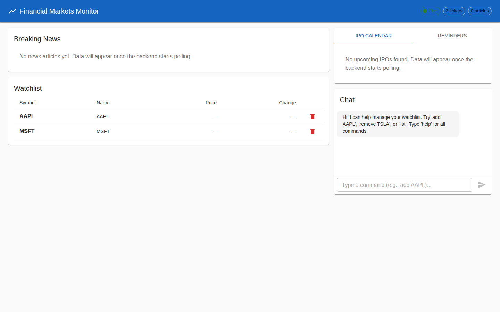

# Local Setup Guide - Financial Markets Monitor

> Step-by-step instructions to bring up the full stack on a developer machine.
> Tested on Ubuntu 24.04 with Python 3.11, Node 22, PostgreSQL 16.

## Screenshot



---

## Prerequisites

| Tool | Version | Install |
|------|---------|---------|
| Python | 3.11+ | `sudo apt install python3 python3-pip` |
| Node.js | 18+ | [nodesource](https://github.com/nodesource/distributions) or `nvm install 18` |
| PostgreSQL | 15+ | `sudo apt install postgresql` |

---

## Step-by-step Setup

### 1. Clone the repo

```bash
git clone <repo-url> && cd claudego
git checkout claude/financial-markets-monitoring-RXTDa
```

### 2. Start and configure PostgreSQL

```bash
# Start PostgreSQL if not running
sudo pg_ctlcluster 16 main start    # adjust version if needed

# Create the database
sudo -u postgres psql -c "CREATE DATABASE finmonitor;"
sudo -u postgres psql -c "ALTER USER postgres PASSWORD 'postgres';"
```

**Important**: PostgreSQL must allow password authentication for local connections.
Edit `/etc/postgresql/16/main/pg_hba.conf` and change:

```
# FROM:
local   all   all   peer
# TO:
local   all   all   md5
```

Then reload:

```bash
sudo pg_ctlcluster 16 main reload
```

> **Why?** The backend uses `asyncpg` which connects via TCP with a password.
> The default `peer` auth only works for Unix socket connections matching OS user to DB user.

### 3. Set up the backend

```bash
cd backend

# Create environment file
cp .env.example .env
# Edit .env — at minimum, DATABASE_URL should be correct (default works if you followed step 2)

# Install Python dependencies
pip install -r requirements.txt

# Start the server
uvicorn app.main:app --reload --port 8000
```

You should see:
```
INFO: Database tables created
INFO: Scheduler started
INFO: Application startup complete.
```

Verify: `curl http://localhost:8000/health` should return `{"status":"ok"}`

### 4. Set up the frontend

Open a **new terminal**:

```bash
cd frontend

# Install Node dependencies
npm install --legacy-peer-deps

# Start dev server
npm start
```

> **Why `--legacy-peer-deps`?** `react-scripts@5` has peer dependency conflicts
> with React 18 and some MUI packages. The `--legacy-peer-deps` flag tells npm
> to use the older resolution algorithm that tolerates these mismatches. This is
> safe and recommended by both CRA and MUI for this combination.

Open http://localhost:3000 in your browser.

### 5. (Optional) Enable live market data

Get a free API key from [finnhub.io](https://finnhub.io/) and add it to `backend/.env`:

```
FINNHUB_API_KEY=your_key_here
```

Restart the backend. News, IPO calendar, and ticker prices will start populating automatically.

---

## Issues Encountered & Fixes

### Issue 1: PostgreSQL `peer` authentication refused connection

**Symptom:**
```
asyncpg.exceptions.InvalidPasswordError: password authentication failed for user "postgres"
```

**Root cause:** Default PostgreSQL installs on Ubuntu use `peer` auth for local connections,
which doesn't work with TCP/password-based drivers like `asyncpg`.

**Fix:** Changed `pg_hba.conf` from `peer` to `md5` for local connections, then reloaded PostgreSQL.

---

### Issue 2: `Cannot find module 'ajv/dist/compile/codegen'`

**Symptom:** Frontend fails to start with:
```
Cannot find module 'ajv/dist/compile/codegen'
Require stack:
- .../node_modules/ajv-keywords/dist/definitions/typeof.js
- .../node_modules/schema-utils/dist/validate.js
- .../node_modules/webpack-dev-server/lib/Server.js
```

**Root cause:** `react-scripts@5` ships with `ajv-keywords` that expects `ajv@8`,
but its own dependency tree resolves `ajv@6`. Known CRA issue.

**Fix:** Explicitly install `ajv@8`:
```bash
npm install ajv@8 --legacy-peer-deps
```

---

### Issue 3: Scheduler spamming errors without API keys

**Symptom:** Backend logs filled with HTTP 401/403 errors from Finnhub every 30-60 seconds.

**Root cause:** The background scheduler tried to poll Finnhub even when no API key was configured.

**Fix:** Added early-return guards in `poll_news()`, `poll_ipos()`, and `poll_quotes()`:
```python
if not settings.finnhub_api_key:
    return
```

---

## Architecture Quick Reference

```
http://localhost:3000  (React + MUI)
        │
        ├── REST calls ──► http://localhost:8000/api/*
        └── WebSocket  ──► ws://localhost:8000/api/ws
                                    │
                                    ├── PostgreSQL (localhost:5432/finmonitor)
                                    ├── Finnhub API (news, quotes, IPOs)
                                    ├── PagerDuty Events API (notifications)
                                    └── SMTP/SES (email notifications)
```

## Useful Commands

```bash
# Test chat API
curl -X POST http://localhost:8000/api/chat \
  -H 'Content-Type: application/json' \
  -d '{"message":"add AAPL"}'

# List watchlist
curl http://localhost:8000/api/tickers

# View API docs (Swagger)
open http://localhost:8000/docs

# Docker Compose (alternative to manual setup)
docker compose up --build
```

---

## Next Steps Before AWS Deployment

1. Get production API keys (Finnhub, PagerDuty, SES)
2. Set up RDS PostgreSQL instance
3. Store secrets in AWS Secrets Manager
4. Build and push Docker images to ECR
5. Deploy via ECS Fargate (see `deploy/aws/`)
